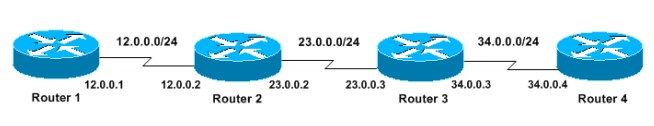
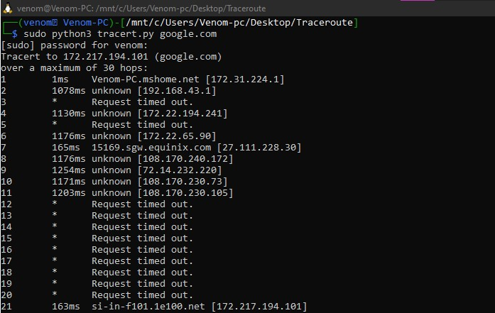
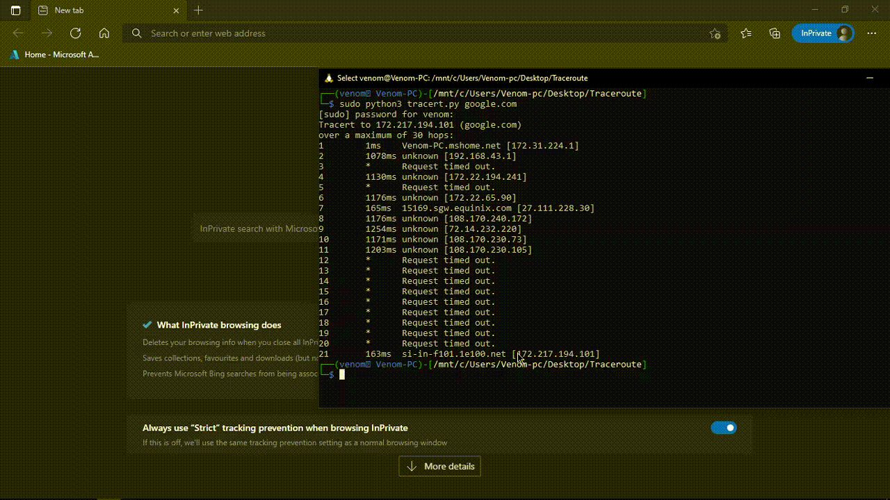
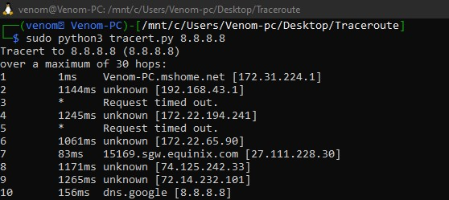
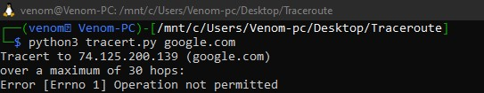
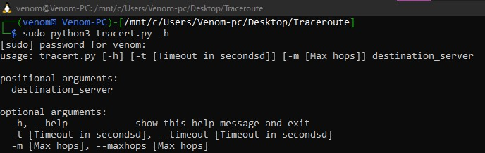

# Python3-Traceroute-Utility
    This illustrates the use of traceroute command

## [Traceroute]
   
   Traceroute and tracert are computer network diagnostic commands for displaying possible routes and measuring transit delays of packets across an Internet Protocol network

#### Article 

https://jadhusan-s.medium.com/generating-details-of-possible-routes-across-an-internet-protocol-network-traceroute-utility-de3724f80359

## _TESTED WITH ;_

 

-----------------------------------
###       W I N D O W S
-----------------------------------
Excute this program using WSL
- open CMD
- navigate to  file path
- type the following command
>python tracert.py www.google.com   
>python tracert.py 8.8.8.8  
-----------------------------------
###         L I N U X
-----------------------------------
- open terminal
- navigate to file path
- type the following command
>sudo python3 tracert.py www.google.com   
>sudo python3 tracert.py 8.8.8.8  

### NOTE
- Run using **Sudo** privilege              - **LINUX**
- Run using **Administration** privilege        - **WINDOWS**
- Use **-h** for help

## Background Information

TTL stands for Time To Live. When a TCP packet is sent, its TTL is set, which is the number    
of routers (hops) it can pass through before the packet is discarded. As the packet passes     
through a router the TTL is decremented until, when the TTL reaches zero, the packet is        
destroyed and an ICMP "time exceeded" message is returned. The return message's TTL is         
set by the terminating router when it creates the packet, and decremented normally.            
 

Trace Route works by setting the TTL for a packet to 1, sending it towards the requested       
destination host, and listening for the reply. When the initiating machine receives a "time    
exceeded" response, it examines the packet to determine where the packet came from - this      
identifies the machine one hop away. Then the tracing machine generates a new packet with      
TTL 2, and uses the response to determine the machine 2 hops away, and so on.                  
 

Unfortunately not all TCP stacks behave correctly. Some TCP stacks set the TTL for the         
ICMP "time exceeded" message to that of the message being killed. So if the TTL is 0, the      
packet will be killed by the next machine to which it is passed. This can have two effects on a    
trace. If the computer is an intermediate machine in the trace, the entry will remain blank. No    
information is returned to the machine conducting the trace because the "time exceeded"            
message never makes it back. If the machine you are doing a trace to has this bug in its TCP       
stack, return packets won't reach the originating machine unless the TTL is high enough to         
cover the round trip. So Trace Route will show a number of failed connections equal to n (the      
number of hops to the destination machine) minus 1.                                                
 

The times in Trace Route are total round trip times in seconds. The Min/Avg/Max should             
increase from machine n to machine n+1, but they may not, for a variety of reasons. To start       
with, the times are based on the number of tests listed in the results column (generally 3 for a    
completed trace). Response times vary depending on network usage. Additionally, returning a        
"time exceeded" message requires more computational time than routing a packet onwards.            
Finally, packet paths may not be the same coming and going.                                        

### Example                           

Router 1# traceroute 34.0.0.4  
Type escape sequence to abort.   
Tracing the route to 34.0.0.4    
 1 12.0.0.2 4 msec 4 msec 4 msec     
 2 23.0.0.3 20 msec 16 msec 16 msec  
 3 34.0.0.4 16 msec * 16 msec    

### Output

 - Domain name

  
  

- Ip Address
 
 
 
- root permission
 
 
 
 - Help
 
 
